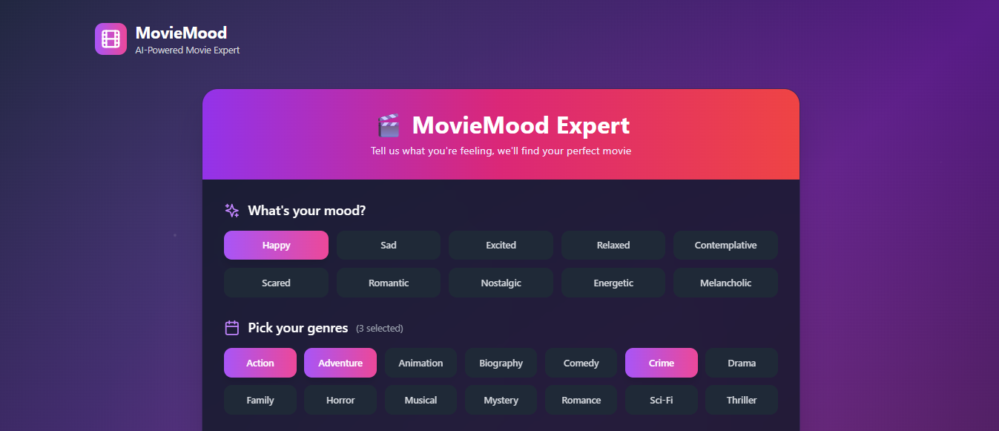
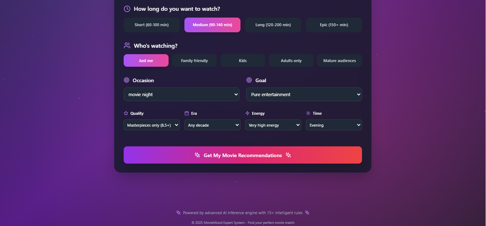
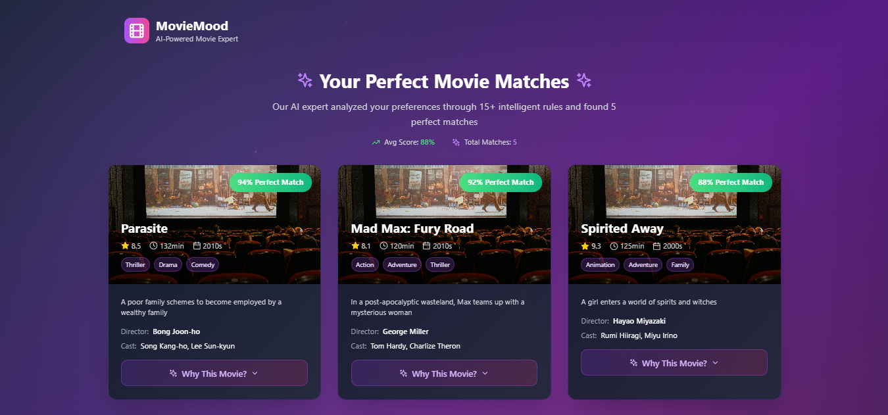
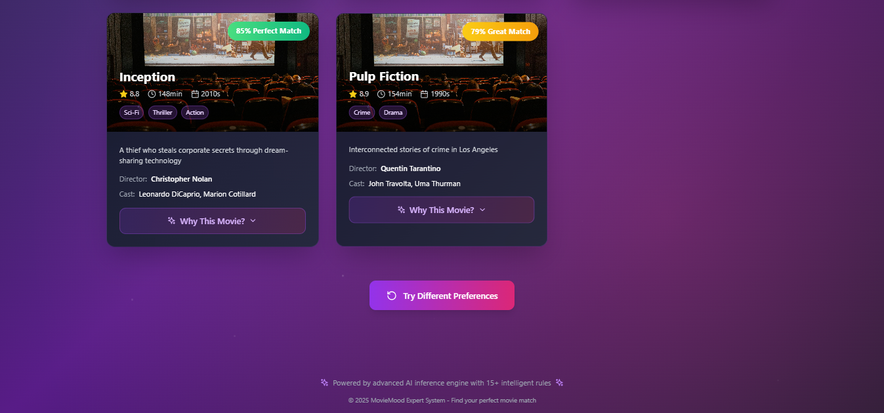

# 🎬 MovieMood - AI-Powered Movie Expert System

MovieMood is a sophisticated rule-based expert system that provides personalized movie recommendations using advanced AI inference with 15+ intelligent rules. Built with React, TypeScript, Framer Motion, and Node.js.

## ✨ Features

### 🧠 Advanced Expert System
- **15+ Intelligent Rules**: Comprehensive rule-based inference engine
- **Forward Chaining**: Advanced AI reasoning with scoring system
- **Multi-Factor Analysis**: Mood, genres, duration, audience, occasion, and more
- **Transparent Reasoning**: See exactly why each movie was recommended

### 🎨 Cinematic UI/UX
- **Movie-Inspired Design**: Netflix-style interface with glassmorphism effects
- **Smooth Animations**: Beautiful Framer Motion transitions and micro-interactions
- **Responsive Design**: Optimized for all devices (mobile to desktop)
- **Interactive Elements**: Hover effects, staggered animations, and loading states

### 🎯 Smart Recommendations
- **Personalized Scoring**: Each movie gets a compatibility score (0-100%)
- **Detailed Explanations**: Understand why each movie was recommended
- **Rule Transparency**: See which of the 15+ rules fired for each recommendation
- **Top 5 Results**: Best matches ranked by AI analysis

## 🚀 Quick Start

### Prerequisites
- Node.js (v16+)
- npm or yarn

### Installation

1. **Clone the repository**
   ```bash
   git clone <repository-url>
   cd moviemood-expert-system
   ```

2. **Install dependencies**
   ```bash
   npm install
   ```

3. **Start the application**
   ```bash
   npm run dev
   ```

   This will start both the frontend (Vite) and backend (Express) servers concurrently:
   - Frontend: http://localhost:5173
   - Backend API: http://localhost:3001

## 🏗️ Architecture

### Frontend (React + TypeScript)
```
src/
├── components/
│   ├── PreferenceForm.tsx      # Interactive form with cinematic design
│   ├── MovieCard.tsx           # Expandable movie cards with animations
│   ├── RecommendationResults.tsx  # Results grid with statistics
│   └── LoadingAnimation.tsx    # Film reel loading animation
├── hooks/
│   └── useMovieRecommendations.ts  # Custom hook for API calls
├── types/
│   └── types.ts                # TypeScript interfaces
├── utils/
│   └── api.ts                  # API utility functions
└── App.tsx                     # Main application component
```

### Backend (Node.js + Express)
```
server/
├── engine/
│   └── Rules.js                # Expert system inference engine
├── data/
│   └── movies.json             # Curated movie database (20+ movies)
└── server.js                   # Express API server
```

## 🧠 Expert System Rules

The AI uses 15+ sophisticated rules to analyze your preferences:

1. **Mood-Genre Harmony** - Matches your mood to appropriate genres
2. **Genre Preference Match** - Weights selected genres heavily  
3. **Duration Sweet Spot** - Finds movies matching your time preference
4. **Audience Compatibility** - Ensures appropriate rating for your audience
5. **Occasion Appropriateness** - Matches movies to specific occasions
6. **Intent Alignment** - Aligns with your viewing goal (entertainment, education, etc.)
7. **Rating Preference** - Filters by quality standards (IMDB rating)
8. **Decade Nostalgia** - Considers era preferences
9. **Energy Level Match** - Matches your current energy level
10. **Time of Day Suitability** - Considers optimal viewing time
11. **High Rewatchability Bonus** - Boosts classics you can watch multiple times
12. **Director's Signature Style** - Recognizes auteur directors
13. **Critical Acclaim Bonus** - Rewards critically acclaimed films
14. **Mood-Energy Synergy** - Combines mood and energy for perfect matches
15. **Genre Diversity Bonus** - Rewards multi-genre storytelling

## 🎨 Design System

### Color Palette
- **Primary**: Purple gradients (`from-purple-600 to-pink-600`)
- **Background**: Dark gradients (`from-gray-900 via-purple-900 to-gray-900`)
- **Cards**: Glassmorphism with `backdrop-blur-xl` effects
- **Accents**: Purple/pink gradient text and borders

### Typography
- **Headlines**: Bold, gradient text with cinematic feel
- **Body**: Clean, readable typography with proper hierarchy
- **Interactive**: Hover states with scale and glow effects

### Animations
- **Loading**: Spinning film reel with floating particles
- **Cards**: Staggered entrance animations and hover effects
- **Form**: Smooth transitions between form steps
- **Results**: Sequential reveal of recommendation cards

## 📊 Movie Dataset

The system includes 22+ carefully curated movies spanning multiple decades and genres:

- **Classics**: Pulp Fiction, The Shining, Goodfellas
- **Modern Hits**: Inception, Parasite, Knives Out  
- **Animation**: Spirited Away, Coco, Finding Nemo
- **Action**: Mad Max: Fury Road, John Wick
- **Romance**: Her, La La Land, Eternal Sunshine
- **Family**: The Princess Bride, The Incredibles

Each movie includes:
- Basic info (title, genres, duration, rating, decade)
- Quality metrics (IMDB rating, director, cast)
- AI tags (mood fit, occasions, energy level, time of day)
- Rich metadata for rule matching

## 🔧 API Endpoints

### `POST /api/recommendations`
Get personalized movie recommendations based on user preferences.

**Request Body:**
```json
{
  "mood": "excited",
  "genres": ["Action", "Sci-Fi"],
  "duration": "medium",
  "audience": "adults",
  "occasion": "movie night",
  "intent": "entertainment",
  "ratingPreference": "great",
  "decade": "2010s",
  "energyLevel": "high",
  "timeOfDay": "evening"
}
```

**Response:**
```json
{
  "success": true,
  "count": 5,
  "recommendations": [
    {
      "movie": { /* Movie object */ },
      "score": 89,
      "reasons": ["Perfect mood match...", "Genre match..."],
      "firedRules": ["Mood-Genre Harmony", "Genre Preference Match"]
    }
  ]
}
```

### `GET /api/options`
Get all available options for the preference form.

### `GET /api/health`
Health check endpoint with system status.

## 🎯 Key Features Explained

### Rule-Based Inference Engine
The heart of MovieMood is a sophisticated inference engine that:
- Evaluates each movie against 15+ intelligent rules
- Assigns weighted scores based on rule matches
- Provides transparent explanations for each recommendation
- Uses forward chaining to build comprehensive movie profiles

### Cinematic User Experience
Every interaction is designed to feel like using a premium streaming service:
- Smooth animations using Framer Motion
- Glassmorphism design with backdrop blur effects
- Interactive hover states and micro-interactions
- Responsive design that works beautifully on all devices

### Intelligent Scoring System
Movies receive compatibility scores (0-100%) based on:
- How many rules they match
- The weight/importance of each matched rule  
- Quality factors (IMDB rating, critical acclaim)
- Personal preference alignment

## 🚀 Deployment

### Development
```bash
npm run dev  # Starts both frontend and backend
```

### Production Build
```bash
npm run build  # Builds optimized frontend
npm run server # Starts production backend
```

### Environment Variables
The system works out of the box with no configuration required. The frontend automatically connects to the backend on port 3001.

## 🤝 Contributing

1. Fork the repository
2. Create a feature branch (`git checkout -b feature/amazing-feature`)
3. Commit your changes (`git commit -m 'Add some amazing feature'`)
4. Push to the branch (`git push origin feature/amazing-feature`)
5. Open a Pull Request

## 📝 License

This project is licensed under the MIT License - see the LICENSE file for details.

## 🎬 Screenshots

### 📝 Form Screens




### 🎯 Recommendations Screens




## 🌟 Acknowledgments

- **Framer Motion** for beautiful animations
- **Tailwind CSS** for rapid styling
- **Lucide React** for beautiful icons
- **Express.js** for robust backend API
- **Pexels** for movie poster placeholder images

---

## 🧑‍💻 Author

**Nduoma Chinomso Christian**  
_AKA Buzz Brain_

---

**Built with ❤️ for movie lovers everywhere** 🍿